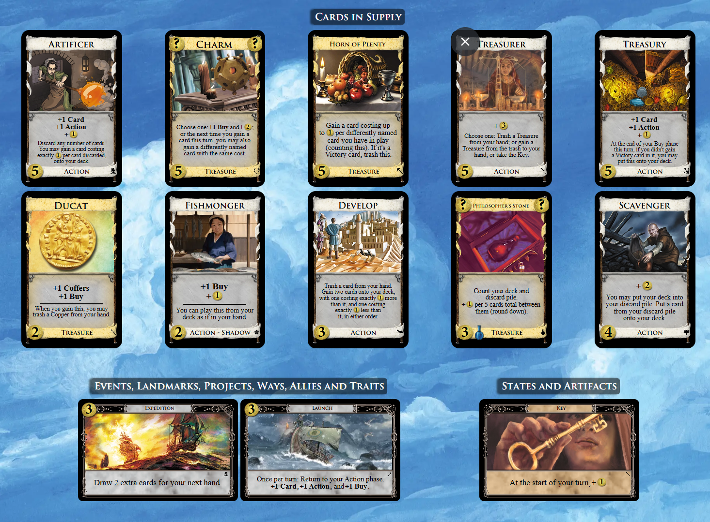
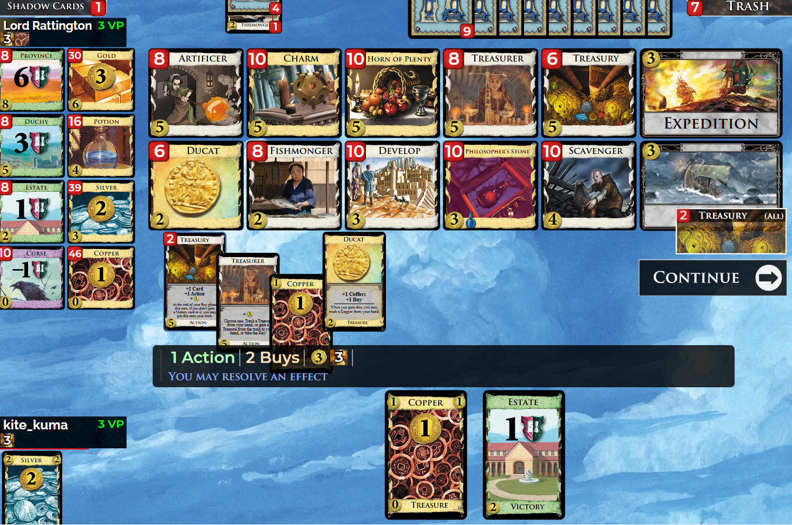
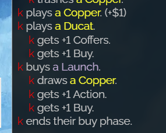
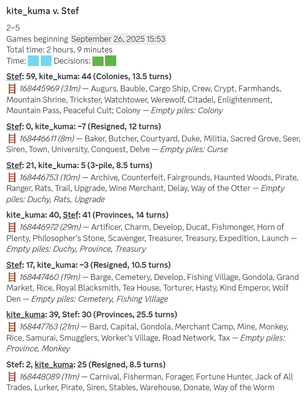

+++
date = '2025-10-01T18:05:44+09:00'
draft = false
title = 'Stef との連戦'
+++

ある日 (2025 年 9 月 26 日) に Dominion Online でレート戦をしていたとき，Stef 氏とマッチした．
レートは 65 前後で，普通ならリーダーボードに載っているほどの実力者であるが，ドミニオンオンラインの開発者であるため掲載されていない．
私も何度か対戦したこともあるが，全く勝てた試しがない．

Stef 氏は対戦前の挨拶だけでなく，対戦中も，例えば手札が事故ったときに uh-oh などと気さくな感じでチャットしてくる．私は 3 連敗しながらも，チャットとプレイの双方を楽しんでいた．そして迎えた 4 戦目でそれは起こった．



上のサプライから，出納官で圧縮しつつ工匠で宝物庫を集める方針を選択．ゲーム開始時点で発進と宝物庫の組み合わせに気付いていたので，宝物庫を打ったターンで意気揚々と発進すると，なぜか宝物庫が 1 ドローの後にデッキに載ってしまう．

ドロー後の undo はしない/認めない主義なのでとりあえず続行することにしたが，なぜ宝物庫を引く動きにならないのか不思議に思いながらゲームが進行していく．これなんでダメなんだろうか．2 回目も失敗したら Stef にチャットで訊いてみよう．

果たして 2 度目の発進も失敗した．





当時のチャットでの会話を抜粋して日本語で再現するとこんな感じである．

```
私: これ宝物庫を載せてから発進の 1 ドローが入ると思うんだけど

Stef: そうだね，それが正しい

私: これバグですか？

Stef: うん，ごめん
```

**いやバグなんかーーーーーい！！**

```
Stef: あとでヴィラとかも直さないといけないんだよね

Stef: 今の仕様だとカードの処理中にフェイズが戻れないんだ

私: 直すの大変だよね，私もコード書く人間だからめんどくささは理解できる
```

私はドミニオンオンラインでバグを見つけたことがなかったが，よりによって初遭遇が開発者との対戦中に起こるとは…面白いこともあるものだなと思う．

この出来事がきっかけで[フェイズ戻りに関するバグの記事](../../dominion_online/phase_switching_bug/index.md)を書いた．
他のバグについても気になるんだけど，修正されていないバグの一覧とかあるんだろうか．とても興味はあるのだが．

ちなみに連戦の結果は 2 勝 5 敗．やっぱつえーよ...でも初勝利をもぎ取れたのは嬉しかった．


