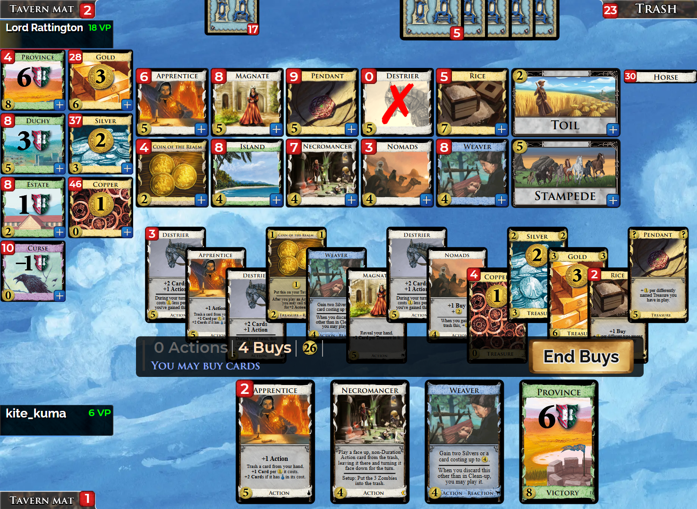
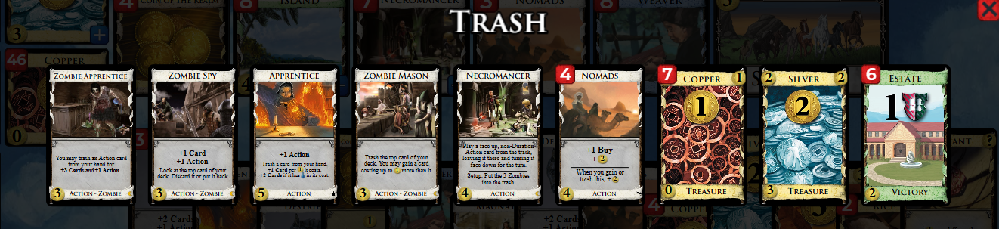

+++
date = '2026-01-04T13:42:11+09:00'
draft = false
title = '01'
+++

Find the win クイズの第 1 回は私の実戦から．ルールについては[こちら](../_index.md)を参照されたい．

購入フェイズで米をプレイしたところ．

廃棄置き場は以下の通り．

{}
## 解答
属州 1 枚を購入する．

苦労を購入して手札からネクロマンサーを使用し，廃棄置き場にあるゾンビの石工を使用する．捨て札の属州が山札となり，それが廃棄されるため，属州を獲得する．

属州を 2 枚購入して終了．

## 解説
ゾンビの石工による空廃棄に気付けるかどうかの問題．
今回の問題では関係ないが，ゾンビの石工は改築系の中では唯一，カードの獲得が強制ではないという点にも注意したい．
今回の状況では属州を 3 回購入してから苦労を購入してもうまく行くが，解答の手順では購入権を 3 しか必要としないためこちらを解答として掲載した．
{}
{}
## おまけ問題
あと 4 金多ければ (つまり，問題の画像で 30 金 4 購入あれば) 3 山を枯らしつつ同点に持ち込んでゲーム終了できるので，こちらも考えてみて頂きたい．
{}
{}
## 解答
苦労を購入して職工を使用，遊牧民を獲得．残りが 30 金 4 購入．

遊牧民 2 枚を購入して，残りが 26 金 2 購入．

苦労を購入して弟子を使用，弟子を廃棄して遊牧民 3 枚をドロー．残りが 24 金 2 購入．

苦労を 4 回購入して，手札の遊牧民 3 枚とネクロマンサーを使用する．ネクロマンサーは廃棄置き場の遊牧民を使用する．残りが 24 金 6 購入．属州 2 枚と法貨 4 枚を購入する．

## 解説
苦労は購入権を消費しないので，遊牧民などの +buy が付いたカードを打つと購入権を増やすことができる．獲得した遊牧民を突貫や都市国家などの効果で使用すれば合計 4 金 1 購入を生むので，遊牧民購入に消費したコストを全て帳消しにすることができることは押さえておきたい．
{}
